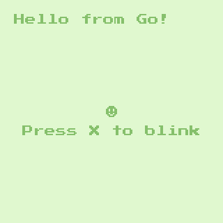

import Tabs from '@theme/Tabs';
import TabItem from '@theme/TabItem';


# Setup your project

Before you can begin, you need a project to work with. The CLI-Tool of WASM-4 includes templates for several programing languages like AssemblyScript, C, Go and Rust. More languages are sure to come in the future.

## The Terminal ...

Work is often easier on a terminal. For this step, open your terminal/powershell and navigate to your projects folder.

For the sake of having the same base, I assume the projects-folder is here: `~/Projects/`.  
On Linux and macOS this is usually `/home/[YOUR USERNAME]/Projects`.  
On Windows this is usually `C:\Users\[YOUR USERNAME]\Projects\`.

Below you'll find instructions for your language.

<Tabs
    groupId="code-language"
    defaultValue="language-typescript"
    values={[
        {label: 'AssemblyScript', value: 'language-typescript'},
        {label: 'C / C++', value: 'language-cpp'},
        {label: 'Rust', value: 'language-rust'},
        {label: 'Go', value: 'language-go'},
    ]}>

<TabItem value="language-typescript">

To compile AssemblyScript projects you will need `npm` installed.

```shell
w4 new --assemblyscript snake
cd snake
```

First we'll setup AssemblyScript (this only needs to be done once):

```shell
npm install
```

Compile the .wasm cartridge:

```shell
npm run build
```

Run it in WASM-4 with:

```shell
w4 watch
```
</TabItem>

<TabItem value="language-cpp">

To compile C/C++ projects you will need to download the [WASI SDK](https://github.com/WebAssembly/wasi-sdk) and set the `$WASI_SDK_PATH` environment variable.

```shell
w4 new --c snake
cd snake
```

Compile the .wasm cartridge:

```shell
make
```

Run it in WASM-4 with:

```shell
w4 watch
```

</TabItem>

<TabItem value="language-rust">

To compile Rust projects you will need `cargo` installed. You will also need the wasm32 target,
which can be installed with `rustup target add wasm32-unknown-unknown`.

```shell
w4 new --rust snake
cd snake
```

Compile the .wasm cartridge:

```shell
cargo build --release
```

Run it in WASM-4 with:

```shell
w4 watch
```

</TabItem>

<TabItem value="language-go">

To compile Go projects you will need `go` and `tinygo` installed.

```shell
w4 new --go snake
cd snake
```

Compile the .wasm cartridge:

```shell
make
```

Run it in WASM-4 with:

```shell
w4 watch
```

</TabItem>

</Tabs>

:::note Prevent Browser from opening
If you don't want the browser to open a new tab for you, you can prevent this by using the `-n` or `--no-browser` option. You can also set an environment variable called `W4_NO_BROWSER`.

Examples:
```shell
w4 watch --no-browser
```
or
```shell
W4_NO_BROWSER=1 w4 watch
```
:::

:::note Setting a default language
You can set a default language by setting the environment variable `W4_LANG` to one of the supported languages.
It's possible to override it with the CLI parameter later on.
:::

## Current state

For now, your game should look this:



The color changes if you press `Button 1` (X or Space).